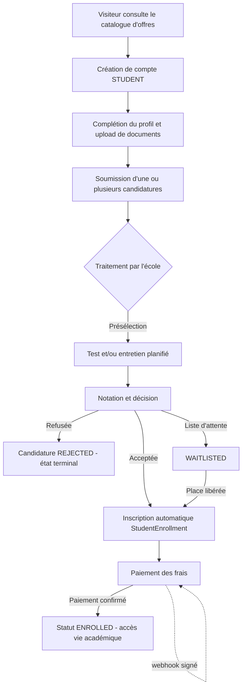
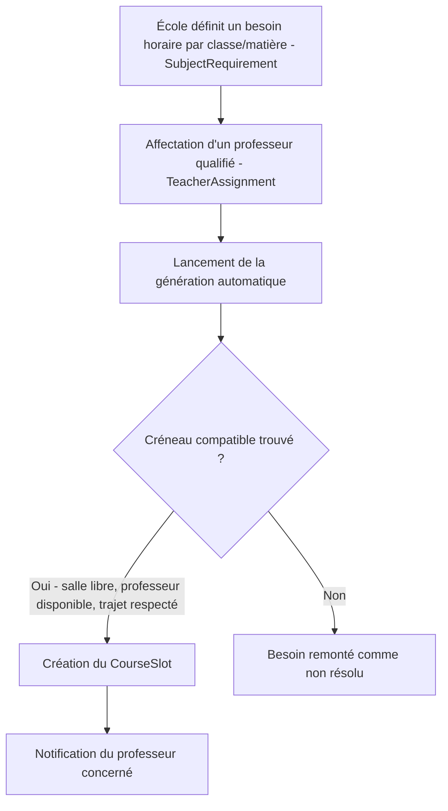
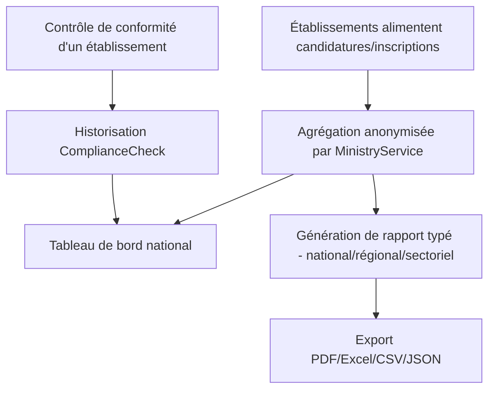

# GET — GRANDES ÉCOLES DE TANANARIVE / MADAGASCAR

## EXPRESSION DES BESOINS — VERSION 1

| Champ | Valeur |
|---|---|
| Projet | GET — Grandes Écoles de Tananarive / Madagascar |
| Document | Expression des Besoins |
| Version du document | 1.0 |
| Version applicative analysée | V1 (première version fonctionnelle) |
| Branche Git analysée | `develop` |
| Commit analysé | `30b7953f30a68c1275fededea6e4471e687dc493` (2026-08-05 08:18:59 +0300) |
| Date de génération | 2026-08-05 |
| Statut du document | Brouillon pour revue métier |
| Auteur | Analyse générée à partir du code source (backend NestJS, frontend Next.js, schéma Prisma) et des documents projet existants, sous supervision humaine |
| Niveau de confidentialité | Usage interne projet GET — ne pas diffuser en dehors de l'équipe projet et des parties prenantes désignées |

---

## HISTORIQUE DES VERSIONS

| Version | Date | Auteur | Description des modifications | Statut |
|---|---|---|---|---|
| 1.0 | 2026-08-05 | Analyse code source + revue projet | Première version reconstruite intégralement à partir du code source de la V1 (commit `30b7953`) et des documents projet existants (ADR, audits, backlog sécurité) | Brouillon pour revue métier |

---

## CIRCUIT DE VALIDATION

| Rôle | Nom ou organisation | Responsabilité | Statut de validation |
|---|---|---|---|
| Product Owner GET | À désigner | Validation de la vision, du périmètre et des priorités | En attente |
| Responsable technique / Tech Lead | À désigner | Validation de l'exactitude technique des constats (preuves code) | En attente |
| Représentant établissement partenaire | À désigner | Validation des parcours École/Professeur | En attente |
| Représentant Ministère de tutelle | À désigner | Validation du périmètre et des besoins du module Ministère | En attente |
| Responsable sécurité / conformité | À désigner | Validation de la section 21.1 (Sécurité) et 22 (Protection des données) | En attente |

> Ce document a été produit par analyse automatisée du code source et des documents projet. Il constitue une base de travail à valider en atelier avec les parties prenantes ci-dessus avant d'être considéré comme référentiel officiel. Toute case « Point à confirmer avec le métier ou l'équipe de développement » doit être levée lors de cette validation.

---

## TABLE DES MATIÈRES

1. Résumé exécutif
2. Contexte et justification du besoin
3. Vision du produit
4. Objectifs du projet
5. Périmètre fonctionnel
6. Parties prenantes
7. Utilisateurs, profils et personas
8. Rôles et habilitations
9. Cartographie des processus métier
10. Description fonctionnelle détaillée par module
11. Catalogue des exigences fonctionnelles
12. Règles de gestion
13. Cycle de vie des objets métier
14. Données métier
15. Écrans et interfaces utilisateurs
16. Notifications et communications
17. Recherche, filtres, tri et pagination
18. Tableaux de bord, indicateurs et reporting
19. Imports et exports
20. Intégrations et services externes
21. Besoins non fonctionnels
22. Exigences de protection des données
23. Critères d'acceptation
24. Matrice de traçabilité
25. Analyse des écarts
26. Questions ouvertes et décisions métier
27. Risques fonctionnels
28. Priorisation des besoins (MoSCoW)
29. Recommandations pour la V2
30. Glossaire
31. Annexes

*(Dans la version Word, cette table des matières est remplacée par un champ TOC automatique généré à partir des styles de titre.)*

---

# 1. RÉSUMÉ EXÉCUTIF

**Contexte.** GET est une plateforme numérique destinée à centraliser le parcours des candidats et étudiants de l'enseignement supérieur à Madagascar (Tananarive en priorité) : recherche d'établissements et de formations, candidature, admission, paiement des frais, puis vie académique (cours, notes, emploi du temps) une fois inscrit. Elle s'adresse à cinq catégories d'acteurs : les **étudiants/candidats**, les **établissements** (via un administrateur d'école), les **professeurs**, le **Ministère de tutelle**, et l'**administration de la plateforme GET** elle-même.

**Réponse apportée par la V1.** L'analyse du code source (21 modules backend, 51 pages frontend réparties sur 5 portails applicatifs, 55 modèles de données) montre qu'une part très substantielle du périmètre métier est réellement implémentée et vérifiée par des tests automatisés : inscription et authentification (avec MFA pour les comptes à privilèges), catalogue public d'établissements et d'offres, candidature multi-offres, cycle de vie complet d'une candidature (présélection, test, entretien, décision, liste d'attente avec promotion automatique), inscription automatique de l'étudiant admis, paiement des frais avec confirmation par webhook signé, vie académique (cours, chapitres, devoirs, notes, emploi du temps), un moteur de planification automatique des cours avec détection de conflits (salle, professeur, temps de trajet inter-établissements), une messagerie interne, un système de notifications et d'annonces, un tableau de bord Ministère strictement anonymisé, et une administration de plateforme (utilisateurs, écoles, contenus du site vitrine, audit).

**Principales limites constatées.** Certaines zones du système restent volontairement ou involontairement incomplètes à ce stade : les canaux de notification email/SMS/push sont simulés (seul le canal in-app est réellement fiable) ; le prestataire de paiement réel n'est pas branché (mode « mock » identifié) ; l'accueil de l'étudiant inscrit et l'écran « Mon parcours » affichent des données non connectées à l'API ; deux écrans (« Bibliothèque », « Stages & emplois ») sont des emplacements réservés explicitement marqués comme non connectés ; le canal d'auto-inscription ne permet de créer que des comptes étudiants (aucune voie de création de compte école) ; certains modules critiques (authentification, audit, notifications) ne disposent d'aucun test automatisé malgré leur sensibilité.

**Niveau de maturité fonctionnelle.** Le cœur du parcours candidat→étudiant (recherche, candidature, admission, paiement, inscription, vie académique de base) apparaît solide et testé. Les fonctions périphériques (concours, partenaires financiers, CMS de la page vitrine, planification avancée) sont également implémentées mais avec une couverture de tests plus faible. La documentation projet existante (audits de juillet-août 2026) décrivait un état antérieur nettement moins avancé — plusieurs anomalies critiques qu'elle recensait (paiement, reset de mot de passe, absence de tests) semblent avoir été en partie corrigées depuis, ce qui traduit une évolution rapide du code non reflétée dans les documents anciens.

**Décisions attendues du métier.** Ce document identifie 27 questions ouvertes nécessitant un arbitrage (section 26), 27 écarts entre l'attendu et l'observé (section 25) et 21 risques fonctionnels (section 27), à traiter prioritairement lors de la validation de cette Expression des Besoins et de la préparation des tests d'acceptation utilisateur (UAT).

---

# 2. CONTEXTE ET JUSTIFICATION DU BESOIN

## 2.1 Contexte du dispositif d'enseignement supérieur visé
Le code et les documents projet situent explicitement GET dans le contexte de l'enseignement supérieur malgache, avec une priorité donnée aux grandes écoles de la région de Tananarive (nom de code du projet, seed de démonstration couvrant ESPA, IST Mahajanga, INSCAE Antananarivo, Université de Toamasina, Université de Fianarantsoa, ISCAM Antananarivo — donc une couverture qui dépasse déjà Tananarive dans les données de démonstration). Aucun document stratégique décrivant précisément les difficultés territoriales, l'inclusion numérique/financière ou les enjeux d'orientation nationaux n'a été trouvé dans le dépôt : ces éléments, bien que cités dans le mandat de cette Expression des Besoins comme axes d'analyse, **ne sont pas documentés dans les sources disponibles et doivent être apportés par le métier** (point à confirmer).

## 2.2 Difficultés adressées, telles que déductibles du système construit
Le système construit répond, en creux, aux difficultés suivantes (déduites de ce qui a été développé, pas d'un document de cadrage stratégique explicite) :
- **Fragmentation de l'information sur l'offre de formation** : le module `offer`/`school` centralise un catalogue public consultable sans authentification (`GET /offers`, `GET /schools`).
- **Lourdeur du processus de candidature papier** : le module `application` digitalise candidature multi-offres, suivi de statut, tests/entretiens, décision.
- **Suivi du paiement des frais** : le module `payment` structure un paiement en ligne (mobile money notamment) relié à la candidature acceptée, avec reçu et historique.
- **Pilotage institutionnel** : le module `ministry` fournit un tableau de bord agrégé et un suivi de conformité par établissement, pensé pour une tutelle publique.
- **Continuité vers la vie académique** : les modules `teaching`/`student`/`school` (cours, notes, emploi du temps) prolongent le parcours après l'admission, plutôt que de s'arrêter à l'inscription.

## 2.3 Éléments confirmés par les documents vs traduits dans le code vs non couverts
| Élément | Statut |
|---|---|
| Admission (candidature multi-offres, décision, liste d'attente) | Confirmé par les documents (ADR, audits) **et** traduit fonctionnellement dans le code, avec tests |
| Paiement des frais avec visibilité financière école scopée | Confirmé par ADR-002 **et** traduit dans le code (`school.service.ts`), mais **non couvert par un test automatisé identifié** |
| Emploi du temps structuré avec détection de conflits | Confirmé par ADR-001 **et** largement dépassé par le code actuel (génération automatique non prévue à l'origine de l'ADR) |
| Pilotage ministériel anonymisé | Traduit dans le code et vérifié par des tests dédiés de politique d'accès (`ministry-access-policy.spec.ts`) |
| Stratégie territoriale, inclusion numérique/financière, enjeux d'orientation nationale | **Aucun document trouvé** — reste stratégique, non couvert par la V1, à formaliser avec le métier |
| Document de vision produit global unique (PRD) | **Absent** — seuls deux ADR ponctuels existent ; la vision doit être reconstituée par déduction du code, ce qui constitue en soi un écart de gouvernance documentaire à signaler |

---

# 3. VISION DU PRODUIT

## 3.1 Formulation de la proposition de valeur (reconstituée)

> Pour les **étudiants et candidats malgaches** qui doivent aujourd'hui multiplier les démarches manuelles et dispersées auprès de chaque établissement, **GET est une plateforme numérique de bout en bout** qui permet de rechercher une formation, candidater, suivre sa décision d'admission, payer ses frais et poursuivre sa vie académique (cours, notes, emploi du temps) depuis un seul compte. Contrairement à des démarches papier ou dispersées école par école, GET **centralise le parcours candidat-étudiant tout en donnant à chaque établissement, et au Ministère de tutelle, une vue de pilotage propre et cloisonnée.**

> Pour les **établissements**, GET est un outil de gestion des admissions et de la vie académique (offres, candidatures, professeurs, cours, emploi du temps, paiements reçus, rapports) qui remplace des outils dispersés (tableurs, papier) par un système unique et traçable, sans partager leurs données avec les autres écoles du réseau.

> Pour le **Ministère de tutelle**, GET est un outil de supervision statistique agrégée (jamais nominative) et de suivi de conformité des établissements du réseau.

## 3.2 Bénéfices par acteur (déduits du système)
- **Étudiant/candidat** : un point d'entrée unique, suivi transparent du statut de candidature, paiement en ligne, accès à sa vie académique une fois inscrit.
- **École** : gestion structurée des admissions et de la vie académique, visibilité financière scopée à son propre établissement, outils de communication (annonces) et de reporting.
- **Professeur** : gestion de ses cours, de ses disponibilités (y compris multi-établissements avec temps de trajet), de ses évaluations et de sa messagerie, sans dépendre de l'administration de l'école pour chaque action.
- **Ministère** : pilotage statistique national sans exposition de données personnelles, suivi de conformité historisé.
- **Administration GET** : vue transverse de la plateforme (utilisateurs, écoles, contenus publics, audit, paramètres).

## 3.3 Ambitions
- **Court terme (V1, ce document)** : fiabiliser et valider le socle déjà construit (admission → paiement → inscription → vie académique de base), fermer les écarts identifiés en section 25.
- **Moyen terme (V2)** : brancher les canaux de notification et le prestataire de paiement réels, connecter les écrans encore mockés ou en attente (« Bibliothèque », « Stages & emplois », accueil étudiant), ouvrir une voie de création de compte pour les établissements.
- **Long terme** : élargir la couverture territoriale et institutionnelle (au-delà des 6 écoles de démonstration), enrichir le pilotage ministériel, structurer un cadre de conformité réglementaire complet (voir section 22).

---

# 4. OBJECTIFS DU PROJET

## 4.1 Objectif général
Fournir une plateforme numérique unique couvrant l'ensemble du parcours post-bac malgache — de la recherche de formation à la vie académique — pour les étudiants, les établissements et les institutions publiques, en remplacement de processus manuels et dispersés.

## 4.2 Objectifs spécifiques par acteur

| Acteur | Objectifs spécifiques observés dans le système |
|---|---|
| Étudiants/candidats | Trouver une formation adaptée (recherche, filtres) ; candidater simplement (multi-offres) ; suivre sa candidature en temps réel ; payer ses frais en ligne ; accéder à sa vie académique (cours, notes, emploi du temps, documents) ; communiquer (messagerie, annonces) |
| Écoles | Publier et gérer ses offres de formation ; traiter les candidatures reçues (test, entretien, décision) ; gérer ses étudiants inscrits, professeurs, cours et emploi du temps ; suivre les paiements reçus ; communiquer avec ses étudiants/professeurs ; produire des rapports |
| Équipes pédagogiques (professeurs) | Gérer le contenu de ses cours ; noter les évaluations et devoirs ; déclarer ses disponibilités (y compris multi-établissements) ; communiquer avec ses étudiants |
| Agents d'admission (rôle porté par SCHOOL_ADMIN dans le code, aucun rôle dédié distinct identifié) | Traiter les candidatures reçues par leur école ; planifier tests/entretiens ; noter et décider |
| Administrateurs GET | Superviser l'ensemble de la plateforme (utilisateurs, écoles, contenus publics) ; consulter l'audit ; piloter les paramètres système |
| Ministère | Superviser statistiquement le réseau d'établissements ; suivre la conformité ; produire des rapports institutionnels |
| Partenaires (financiers) | Être visibles auprès des candidats comme solution de financement (mise en avant vitrine, pas d'intégration transactionnelle directe identifiée) |
| Support | **Aucun rôle ni module dédié « support » identifié dans le code** — point à confirmer avec le métier (section 26) |

## 4.3 Objectifs mesurables

| Indicateur | Statut |
|---|---|
| Nombre de candidatures par établissement/statut/période | Indicateur déjà calculé (`ministry.service.ts`, `school.service.ts` rapports pipeline) |
| Taux d'acceptation (candidatures acceptées / total) | Indicateur déjà calculé (`admin-dashboard.service.ts`) |
| Chiffre d'affaires plaforme (paiements complétés) | Indicateur déjà calculé (`admin-dashboard.service.ts`), à noter : reflète des paiements en mode simulé tant que le prestataire réel n'est pas branché |
| Nombre d'étudiants inscrits distincts vs nombre d'inscriptions (double cursus) | Indicateur déjà calculé et explicitement distingué (`admin-dashboard.service.ts`) |
| Répartition géographique des candidatures | Indicateur déjà calculé (`ministry.service.ts`) |
| Taux de conformité des établissements | Données disponibles (`ComplianceCheck`), calcul de synthèse à confirmer avec le métier (quel seuil, quelle pondération) |
| Taux d'usage réel des canaux de notification (email/SMS ouverts) | Indicateur souhaité à confirmer — aujourd'hui les canaux ne sont pas branchés à un fournisseur réel, donc non mesurable |
| Délai moyen de traitement d'une candidature (soumission → décision) | Donnée disponible (`ApplicationTimeline` horodatée), calcul de synthèse à construire — indicateur souhaité à confirmer |

---

# 5. PÉRIMÈTRE FONCTIONNEL

## 5.1 Périmètre couvert par la V1 (fonctionnalités réellement observées, avec test ou preuve de code solide)
Authentification et gestion de compte (inscription, connexion, MFA, verrouillage anti brute-force, réinitialisation de mot de passe) ; profil étudiant et documents ; catalogue public d'écoles et d'offres ; candidature multi-offres ; cycle de vie complet de la candidature (présélection, test, entretien, score, décision, liste d'attente avec promotion automatique) ; inscription automatique post-admission (y compris multi-établissements) ; paiement des frais avec webhook signé ; vie académique (cours, chapitres, ressources, devoirs, évaluations, notes, emploi du temps étudiant) ; gestion école complète (programmes, années académiques, classes, salles, créneaux, professeurs, matières, exigences d'admission) ; moteur de planification automatique des cours avec détection de conflits (salle, professeur, trajet inter-établissements) ; messagerie interne ; notifications in-app ; annonces ciblées ; tableau de bord et rapports Ministère (anonymisés) ; conformité des établissements ; administration de plateforme (utilisateurs, écoles, CMS landing, concours, partenaires financiers, audit, paramètres système). Le détail exhaustif est porté par le catalogue d'exigences fonctionnelles (section 11, 138 exigences) et la description par module (section 10).

## 5.2 Périmètre partiellement couvert
- **Notifications multicanal** : seul le canal in-app est réellement persistant et fiable ; email/SMS/push sont simulés en code (`console.log`), sans intégration à un fournisseur réel identifiée.
- **Paiement réel** : le fournisseur branché en code est un `MockPaymentProvider` ; les moyens de paiement réels (Orange Money, Mvola, carte, virement) sont modélisés en DTO mais non intégrés à un prestataire réel.
- **Préférences de notification utilisateur** : l'écran existe, mais leur persistance est simulée côté service (non écrites en base).
- **Accueil étudiant inscrit et écran « Mon parcours »** : interfaces complètes visuellement mais alimentées par des données codées en dur, sans connexion à l'API.
- **Vérification de documents étudiants** : un circuit de vérification (`isVerified`, `verifiedBy`) existe en base, mais aucun endpoint de validation par un agent n'a été identifié dans le backend.

## 5.3 Hors périmètre V1
- Écrans « Bibliothèque » et « Stages & emplois » côté étudiant : emplacements réservés explicites (« Coming Soon »), aucune fonctionnalité.
- Auto-inscription pour un rôle autre qu'étudiant (école, professeur, ministère, admin) : aucune voie identifiée dans le code, uniquement provisionnable via le seed de démonstration ou une action serveur non exposée par API publique.
- Abonnement payant école (`SchoolSubscription`) : modèle de données présent, aucune logique de service associée.
- Modèles de notification réutilisables (`NotificationTemplate`) : modèle présent, aucun usage identifié dans le code.
- Rôle ou module « support » dédié : absent.
- Refresh token / prolongation de session automatique : jeton généré et posé en cookie, mais aucun endpoint de rafraîchissement n'existe côté backend ni n'est consommé côté frontend.

## 5.4 Dépendances fonctionnelles
| Dépendance | Nature | Statut observé |
|---|---|---|
| Établissements partenaires | Fournisseurs de données (offres, professeurs, classes) | Actif (6 écoles en démonstration) |
| Ministère de tutelle | Consommateur de données agrégées, valideur de conformité | Actif (module dédié) |
| Prestataires de paiement mobile money / carte | Traitement transactionnel réel | **Non branché** — mode simulé |
| Service d'email/SMS/push | Livraison des notifications | **Non branché** — mode simulé |
| Stockage de fichiers (S3-compatible) | Documents, avatars, logos, pièces jointes | Actif (MinIO/R2/AWS selon configuration) |
| Solution d'identité | Authentification | Interne (JWT), pas de fournisseur d'identité externe (SSO) identifié |
| Référentiel géographique (villes/régions de Madagascar) | Filtres de recherche | Texte libre observé, pas de référentiel structuré identifié — à confirmer |

---

# 6. PARTIES PRENANTES

| Partie prenante | Rôle | Besoins | Responsabilités | Niveau d'influence | Niveau d'intérêt |
|---|---|---|---|---|---|
| Étudiants / candidats | Utilisateur final principal | Simplicité, transparence du suivi, fiabilité du paiement | Fournir des informations exactes, respecter les délais de candidature | Faible (individuel), Élevé (collectif) | Élevé |
| Établissements (administrateurs d'école) | Utilisateur métier / client de la plateforme | Outils de gestion fiables, isolation stricte de leurs données | Traiter les candidatures dans les délais, tenir à jour leur offre | Élevé | Élevé |
| Professeurs | Utilisateur métier secondaire | Outils simples pour la vie académique quotidienne | Tenir à jour cours, notes, disponibilités | Moyen | Moyen |
| Ministère de tutelle | Institution publique de supervision | Statistiques fiables et anonymisées, suivi de conformité | Définir les exigences réglementaires de conformité | Élevé | Élevé |
| Administration GET | Exploitant de la plateforme | Vue transverse, outils d'administration, traçabilité (audit) | Superviser la plateforme, gérer les comptes, arbitrer les priorités | Très élevé | Très élevé |
| Partenaires financiers | Tiers mis en avant sur la plateforme | Visibilité auprès des candidats | Fournir logo/description à jour | Faible | Faible |
| Équipe de développement | Réalisation technique | Spécifications claires et traçables | Implémenter, tester, documenter | Élevé | Élevé |
| Product Owner GET | Pilotage produit | Arbitrage des priorités et du périmètre | Valider ce document et les suivants | Très élevé | Très élevé |

---

# 7. UTILISATEURS, PROFILS ET PERSONAS

> Conformément à la consigne de ne pas inventer de persona fictif nominatif, les profils ci-dessous sont décrits de façon générique, strictement à partir des attributs et comportements observés dans le code (champs de données manipulés, actions disponibles, restrictions).

## 7.1 Étudiant / candidat (rôle `STUDENT`)
**Description** : toute personne créant un compte via l'inscription publique (seule voie d'auto-inscription du système). **Deux états fonctionnels** distincts observés : *candidat* (aucune inscription active — `StudentEnrollment` absente) et *étudiant inscrit* (au moins une inscription active, éventuellement dans plusieurs écoles).
**Objectifs** : trouver une formation, candidater, suivre sa décision, payer, puis (une fois inscrit) suivre ses cours/notes/emploi du temps.
**Besoins** : simplicité du formulaire de candidature, transparence du statut, fiabilité du paiement.
**Frustrations potentielles** (déduites des écarts observés) : accueil et « Mon parcours » affichant des données non réelles une fois inscrit ; écrans « Bibliothèque »/« Stages & emplois » non fonctionnels.
**Compétence numérique / appareils** : non documenté dans le code ; l'interface est responsive (breakpoints 375/390/768/1024px selon `RESPONSIVE_TEST_CHECKLIST.md`), suggérant un usage mobile anticipé.
**Données manipulées** : identité, coordonnées (chiffrées : téléphone, CIN), parcours bac, documents, candidatures, paiements, notes, messages.
**Contraintes** : un seul rôle par compte ; une seule candidature par offre ; mot de passe à règles de complexité fortes.

## 7.2 École (rôle `SCHOOL_ADMIN`)
**Description** : gestionnaire d'un établissement, rattaché à une école unique (`SchoolAdmin.schoolId`), avec permissions fines (`OFFERS_MANAGE`, `STUDENTS_MANAGE`, `PAYMENTS_VIEW` observées en démonstration).
**Objectifs** : gérer l'offre de formation, traiter les candidatures, gérer les étudiants/professeurs/cours, suivre les paiements reçus.
**Besoins** : isolement strict de ses données vis-à-vis des autres écoles, outils de planification fiables.
**Données manipulées** : offres, candidatures de son école, étudiants inscrits, professeurs affectés, cours, paiements reçus par son école.
**Contraintes** : ne peut agir que sur les ressources de sa propre école (contrôle de propriété systématique observé et testé).

## 7.3 Professeur (rôle `TEACHER`)
**Description** : peut être affecté à plusieurs écoles (`TeacherSchool`), profil indépendant de son établissement.
**Objectifs** : gérer le contenu pédagogique de ses cours, noter, déclarer ses disponibilités.
**Besoins** : vue consolidée multi-écoles, prise en compte des temps de trajet entre établissements.
**Données manipulées** : ses cours, ses évaluations/notes, ses disponibilités, ses messages.
**Contraintes** : accès exclusivement à ses propres cours/ressources (vérifié en service).

## 7.4 Ministère (rôle `MINISTRY`)
**Description** : institution de tutelle, accès strictement anonymisé.
**Objectifs** : piloter statistiquement le réseau, suivre la conformité.
**Besoins** : fiabilité des agrégats, absence totale de données nominatives.
**Contraintes** : exclusion explicite et testée des détails nominatifs de candidature, paiement et messagerie.

## 7.5 Administrateur GET (rôle `ADMIN_GET`)
**Description** : rôle plateforme le plus privilégié, aucun « super-admin » distinct.
**Objectifs** : superviser l'ensemble du système, gérer les comptes, arbitrer les contenus publics.
**Données manipulées** : tout le périmètre applicatif.
**Contraintes** : ne peut pas désactiver son propre compte.

## 7.6 Visiteur non authentifié
**Description** : tout internaute consultant la page vitrine, le catalogue d'écoles/offres, sans compte.
**Objectifs** : découvrir la plateforme, s'orienter avant de candidater.
**Actions possibles** : consultation uniquement ; inscription/connexion pour aller plus loin.

---

# 8. RÔLES ET HABILITATIONS

## 8.1 Rôles réels du système
Le système ne compte que **5 rôles** applicatifs, tous créés par le script de démonstration (`Role` en base, table libre — pas d'enum contraint) : `STUDENT` (rôle par défaut), `SCHOOL_ADMIN`, `TEACHER`, `MINISTRY`, `ADMIN_GET`. Aucun rôle « agent d'admission », « support » ou « super administrateur » distinct n'existe : le traitement des candidatures est porté par `SCHOOL_ADMIN`/`ADMIN_GET`, et il n'existe pas de rôle plus privilégié qu'`ADMIN_GET`.

## 8.2 Matrice fonctionnalité × rôle (synthèse)

| Fonctionnalité | Visiteur | Étudiant | École | Professeur | Ministère | Admin GET |
|---|---:|---:|---:|---:|---:|---:|
| Consulter le catalogue public (écoles, offres) | ✅ | ✅ | ✅ | ✅ | ✅ | ✅ |
| S'inscrire / se connecter | ✅ | ✅ | ✅ | ✅ | ✅ | ✅ |
| Candidater | ❌ | ✅ | ❌ | ❌ | ❌ | ❌ |
| Traiter une candidature (statut, test, entretien, score) | ❌ | ❌ | ✅ (son école) | ❌ | ❌ | ✅ |
| Payer les frais | ❌ | ✅ (ses candidatures) | ❌ | ❌ | ❌ | ❌ |
| Consulter les paiements reçus | ❌ | ✅ (les siens) | ✅ (son école) | ❌ | ❌ | ✅ |
| Gérer les cours / évaluations / notes | ❌ | ➖ (consultation des siens) | ✅ (son école) | ✅ (les siens) | ❌ | ❌ |
| Gérer l'emploi du temps / planification | ❌ | ➖ (consultation) | ✅ (son école) | ➖ (disponibilités) | ❌ | ➖ (recherche/conflits) |
| Consulter les statistiques nationales anonymisées | ❌ | ❌ | ❌ | ❌ | ✅ | ✅ |
| Consulter/éditer la conformité d'un établissement | ❌ | ❌ | ❌ | ❌ | ✅ | ✅ |
| Messagerie interne | ❌ | ✅ | ✅ | ✅ | ❌ (exclu) | ✅ |
| Gérer les comptes utilisateurs | ❌ | ❌ | ❌ | ❌ | ❌ | ✅ |
| Consulter le journal d'audit | ❌ | ❌ | ❌ | ❌ | ❌ | ✅ |
| Éditer le contenu du site vitrine (CMS) | ❌ | ❌ | ❌ | ❌ | ❌ | ✅ |

*(Légende : ✅ accès complet, ➖ accès partiel/scopé, ❌ aucun accès. Détail complet endpoint par endpoint avec fichier de preuve : voir `_inventaire/roles-auth-inventory.md` et section 24 Matrice de traçabilité.)*

## 8.3 Droits détaillés et remarques transverses
- **Droits de consultation/création/modification/suppression** : systématiquement scopés à la ressource propre pour STUDENT (son profil, ses candidatures) et SCHOOL_ADMIN (son école) ; sans restriction pour ADMIN_GET ; strictement en lecture agrégée pour MINISTRY.
- **Accès aux données personnelles** : STUDENT (les siennes), SCHOOL_ADMIN (les étudiants de son école), ADMIN_GET (tout), MINISTRY (**aucune donnée nominative**, vérifié par tests dédiés).
- **Capacité de délégation** : aucune (pas de mécanisme d'impersonation ou de délégation identifié).
- **Séparation des responsabilités** : un utilisateur ne porte qu'un seul rôle (`User.roleId` unique) — pas de cumul de rôles observé.
- **Incohérence relevée** : `GET /audit/me` (« mes propres logs d'audit ») hérite du contrôle de classe `@Roles('ADMIN_GET')` et est donc **inaccessible aux autres rôles malgré son nom** — voir écart GET-ECART correspondant en section 25.
- **Protection réelle** : la protection par rôle repose **entièrement sur le backend** (`RolesGuard`) ; le frontend n'a aucun `middleware.ts` Next.js et ne fait qu'une redirection de confort côté client, explicitement documentée comme non suffisante dans le code lui-même.

---

# 9. CARTOGRAPHIE DES PROCESSUS MÉTIER

Le détail de chaque processus (acteurs, préconditions, étapes nominales, variantes, exceptions, données produites, notifications, critères de réussite) est disponible dans `_inventaire/parcours-utilisateurs.md` (7 parcours documentés) et dans le catalogue d'exigences (section 11). Cette section présente les diagrammes des workflows les plus structurants du système.

## 9.1 Processus de candidature et d'admission

## 9.2 Machine à états de la candidature (`Application.status`)
Voir diagramme Mermaid détaillé et table complète des transitions dans `_inventaire/cycles-de-vie.md` (section Application). Point clé : `REJECTED` et `CANCELLED` sont des états **terminaux** (aucun retour arrière possible), garde ajoutée explicitement pour empêcher un passage direct `REJECTED → ACCEPTED`.

## 9.3 Machine à états du paiement (`Payment.status`)
Voir diagramme Mermaid détaillé dans `_inventaire/cycles-de-vie.md` (section Payment). Le passage à `COMPLETED` déclenche, dans la même transaction, l'inscription réelle de l'étudiant (`StudentEnrollment` + synchronisation des cours), garantissant qu'aucun paiement confirmé ne reste sans effet sur le dossier de l'étudiant.

## 9.4 Processus de planification automatique de l'emploi du temps

## 9.5 Processus de pilotage ministériel

