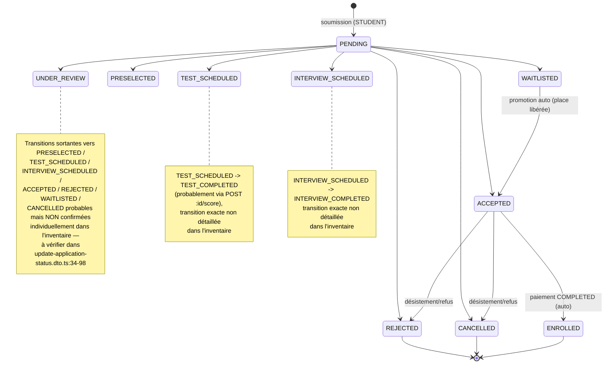
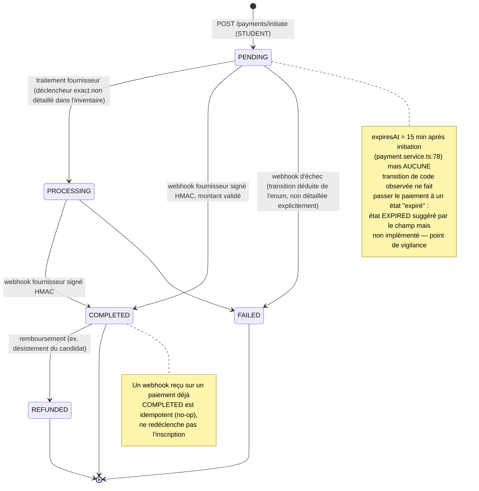
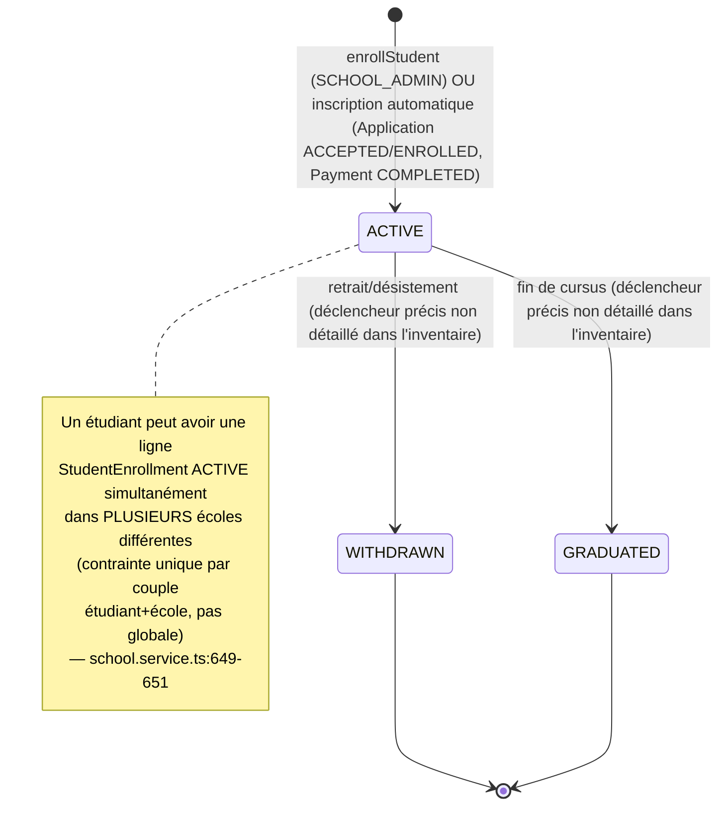
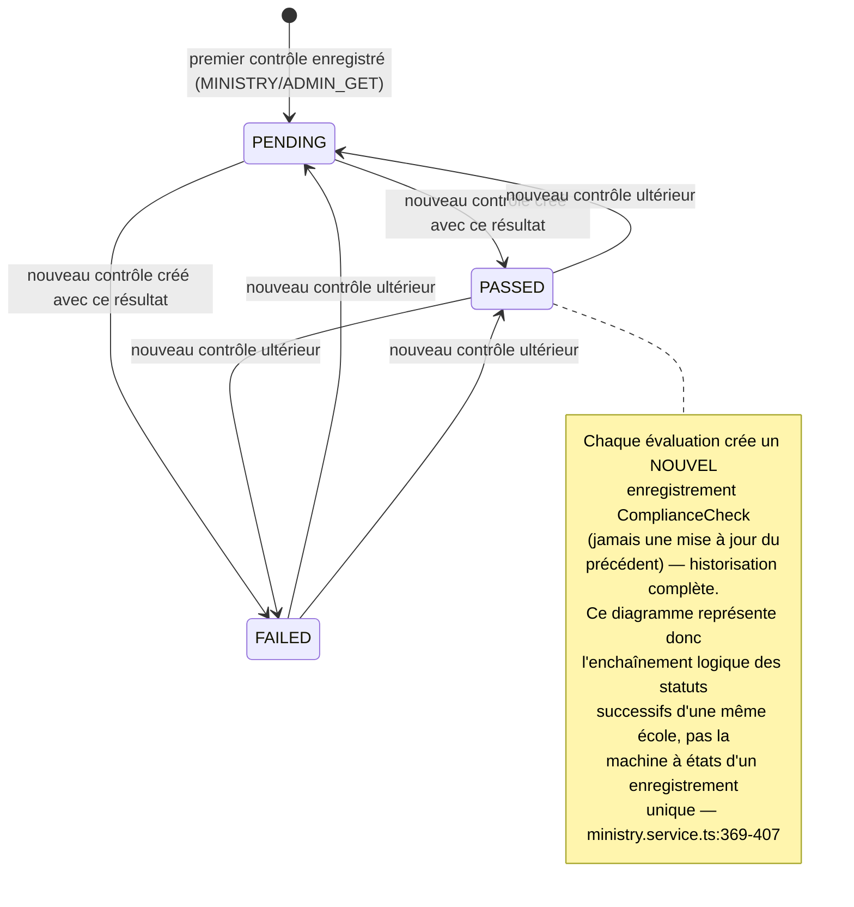

# Cycles de vie des objets métier — Plateforme GET

> Document produit pour l'Expression des Besoins, à partir de l'analyse statique du code source consignée dans `backend-inventory.md` et `data-model-inventory.md` (générés le 2026-08-05). Pour chaque objet métier disposant d'un statut ou d'un cycle de vie identifiable, ce document liste les statuts, leur signification métier, les transitions observées (source → cible), les acteurs autorisés, les actions/notifications déclenchées, les transitions interdites, et les conditions de retour arrière le cas échéant. Lorsqu'une transition est plausible au vu de l'énumération des statuts mais que son déclencheur exact n'a pas été confirmé dans le code lu, elle est explicitement signalée comme telle plutôt que présentée comme un fait établi.
>
> Les diagrammes Mermaid (`stateDiagram-v2`) des 4 objets les plus critiques (Application, Payment, StudentEnrollment, ComplianceCheck) ne représentent que les transitions effectivement citées dans les inventaires sources ; les zones d'incertitude y sont matérialisées par des notes plutôt que par des flèches supposées.

---

## 1. Application (candidature) — CRITIQUE

**Rôle métier** : pivot central du parcours d'admission d'un étudiant à une offre de formation.

### Statuts et signification

| Statut | Signification métier |
|---|---|
| PENDING | Candidature soumise, en attente de premier traitement par l'école |
| UNDER_REVIEW | En cours d'examen par l'école |
| PRESELECTED | Candidat présélectionné, avant test ou entretien |
| TEST_SCHEDULED | Un test/concours a été programmé pour ce candidat |
| TEST_COMPLETED | Le test a été passé, résultat en attente de décision |
| INTERVIEW_SCHEDULED | Un entretien a été programmé |
| INTERVIEW_COMPLETED | L'entretien a été mené, décision en attente |
| ACCEPTED | Candidature acceptée, place réservée sous contrôle de capacité de l'offre |
| REJECTED | Candidature refusée — **état terminal** |
| WAITLISTED | Candidat en liste d'attente, promu automatiquement si une place se libère |
| ENROLLED | Inscription confirmée (déclenchée par la confirmation du paiement) |
| CANCELLED | Candidature annulée — **état terminal** |

### Transitions confirmées

| Source | Cible | Acteur | Déclencheur | Actions/notifications | Preuve |
|---|---|---|---|---|---|
| *(création)* | PENDING | STUDENT | `POST /applications` (candidature multi-offres) | — | `application.controller.ts:53-55` |
| PENDING | UNDER_REVIEW / PRESELECTED / TEST_SCHEDULED / INTERVIEW_SCHEDULED / ACCEPTED / REJECTED / WAITLISTED / CANCELLED | SCHOOL_ADMIN, ADMIN_GET | `PUT /applications/:id/status` | `NotificationService.sendApplicationStatusUpdate` (candidat concerné) ; journalisation audit avant/après | `update-application-status.dto.ts:34-98` ; `application.service.ts:376-389, 587-599` |
| ACCEPTED | ENROLLED | Système (automatique) | Confirmation de paiement (webhook COMPLETED) | Upsert `StudentEnrollment`, synchro inscriptions cours, création `Transaction`, traçabilité `ApplicationTimeline` | `payment.service.ts:133-247` |
| ACCEPTED | REJECTED / CANCELLED | SCHOOL_ADMIN, ADMIN_GET (ou étudiant selon canal non détaillé) | Désistement/refus après acceptation | Libère la place ⇒ déclenche la promotion automatique décrite ci-dessous | `application.service.ts:530-567` |
| WAITLISTED | ACCEPTED | Système (automatique) | Libération d'une place suite à un désistement/refus après acceptation | Notification au candidat promu (`sendApplicationStatusUpdate`) | `application.service.ts:530-567, 572-585` |

### Transitions interdites

- **REJECTED → \*** : impossible, état terminal (confirmé explicitement par test : refus d'un `REJECTED → ACCEPTED` direct).
- **CANCELLED → \*** : impossible, état terminal.

### Zones non confirmées dans l'inventaire

Le document source (`backend-inventory.md`) cite la matrice `APPLICATION_STATUS_TRANSITIONS` en indiquant « PENDING → UNDER_REVIEW/PRESELECTED/TEST_SCHEDULED/INTERVIEW_SCHEDULED/ACCEPTED/REJECTED/WAITLISTED/CANCELLED, **etc.** » — la mention « etc. » signale que d'autres transitions existent (notamment depuis UNDER_REVIEW, PRESELECTED, TEST_SCHEDULED, TEST_COMPLETED, INTERVIEW_SCHEDULED, INTERVIEW_COMPLETED) sans que leur détail exact ait été extrait dans cette passe d'analyse. **Statut : À CONFIRMER directement dans `update-application-status.dto.ts:34-98`** pour obtenir la matrice complète.

### Diagramme d'état

---

## 2. Payment (paiement) — CRITIQUE

**Rôle métier** : paiement des frais de scolarité liés à une candidature ACCEPTED.

### Statuts et signification

| Statut | Signification métier |
|---|---|
| PENDING | Paiement initié, en attente de traitement par le fournisseur |
| PROCESSING | Paiement en cours de traitement chez le fournisseur (état intermédiaire observé dans le code, déclencheur exact non détaillé) |
| COMPLETED | Paiement confirmé — déclenche l'inscription réelle de l'étudiant |
| FAILED | Paiement échoué |
| REFUNDED | Paiement remboursé (ex. désistement du candidat) |
| *(EXPIRED — non implémenté)* | Suggéré par le champ `expiresAt` (15 min après initiation) mais aucun code n'a été trouvé qui fasse effectivement transiter un paiement vers un tel état |

### Transitions confirmées

| Source | Cible | Acteur | Déclencheur | Actions/notifications | Preuve |
|---|---|---|---|---|---|
| *(création)* | PENDING | STUDENT | `POST /payments/initiate` (candidature ACCEPTED requise) | Montant dérivé de `offer.tuitionFees`, commission 5 % calculée, `expiresAt` = +15 min | `payment.service.ts:37-79` |
| PENDING / PROCESSING | COMPLETED | Fournisseur de paiement (webhook, `@Public()` signé HMAC) | `POST /payments/webhook` avec signature valide et montant correspondant | Transaction unique : `Application → ENROLLED`, upsert `StudentEnrollment`, synchro cours, création `Transaction`, traçabilité `ApplicationTimeline` | `payment.service.ts:133-247, 443-455` |
| COMPLETED | REFUNDED | Non détaillé explicitement (module `Refund`, `reason` observé « Désistement du candidat ») | Remboursement | Création d'un enregistrement `Refund` | `data-model-inventory.md — Refund` ; `seed.ts` |

### Transitions non confirmées / points de vigilance

- **PENDING → PROCESSING** et **PENDING/PROCESSING → FAILED** : présentes dans l'énumération des statuts observés dans le code, mais le déclencheur exact (callback fournisseur intermédiaire ? logique interne ?) n'a pas été détaillé dans l'inventaire — **À CONFIRMER**.
- **Idempotence** : un webhook reçu sur un paiement déjà COMPLETED est traité comme un no-op (pas de re-déclenchement de l'inscription) — `payment.service.ts:443-455`.
- **Expiration (15 min)** : le champ `expiresAt` est positionné à l'initiation mais **aucune transition de statut observée** ne matérialise l'expiration effective (pas de job/cron identifié, pas de vérification au niveau du webhook empêchant un paiement expiré de passer COMPLETED) — point de vigilance à traiter avec le métier avant mise en production (cf. GET-RG-072/GET-RG-076 du catalogue des règles de gestion).

### Diagramme d'état

---

## 3. StudentEnrollment (inscription école) — CRITIQUE

**Rôle métier** : inscription active d'un étudiant dans un établissement, pour une filière/niveau/année donnés.

### Statuts et signification

| Statut | Signification métier |
|---|---|
| ACTIVE | Étudiant effectivement inscrit et suivant son cursus dans cette école |
| WITHDRAWN | Étudiant retiré/désinscrit de cette école (abandon, transfert) |
| GRADUATED | Étudiant diplômé, cursus achevé dans cette école |

### Transitions confirmées

| Source | Cible | Acteur | Déclencheur | Actions/notifications | Preuve |
|---|---|---|---|---|---|
| *(création)* | ACTIVE | SCHOOL_ADMIN | `POST me/students/enroll[/bulk]` (inscription manuelle) | Vérifications : fenêtre d'inscription ouverte, programme actif, niveau ≤ durée du programme | `school.service.ts:658-674` |
| *(création)* | ACTIVE | Système (automatique) | `Application` passant à ACCEPTED/ENROLLED **ou** `Payment` passant à COMPLETED | Upsert (une ligne par école), synchro des inscriptions de cours, transaction atomique | `application.service.ts:415-527` ; `payment.service.ts:133-247` |
| ACTIVE | *(mise à jour de statut/programme/niveau)* | SCHOOL_ADMIN | `PATCH me/students/:studentId` | — | `school.controller.ts:556` |

### Transitions non confirmées / points de vigilance

- **ACTIVE → WITHDRAWN** et **ACTIVE → GRADUATED** : les valeurs de statut existent dans le modèle de données et la mise à jour générique `PATCH me/students/:studentId` permet vraisemblablement de les positionner, mais aucun déclencheur métier spécifique (ex. un bouton « désinscrire » distinct, ou un processus de fin d'année automatique pour GRADUATED) n'a été détaillé dans l'inventaire — **À CONFIRMER**.
- **Retour arrière (WITHDRAWN/GRADUATED → ACTIVE)** : aucune transition de ce type n'a été observée dans le code lu — à considérer comme interdite par défaut, sauf confirmation contraire du métier.

### Règle transverse essentielle

Un étudiant peut avoir une ligne `StudentEnrollment` ACTIVE **simultanément dans plusieurs écoles différentes** (double diplôme, cursus parallèle) : la contrainte d'unicité porte sur le couple (étudiant, école), pas sur l'étudiant seul — `school.service.ts:649-651` ; `schema.prisma:129`.

### Diagramme d'état

---

## 4. ComplianceCheck (contrôle de conformité école) — CRITIQUE

**Rôle métier** : évaluation périodique de la conformité d'un établissement par le Ministère/l'administration GET.

### Statuts et signification

| Statut | Signification métier |
|---|---|
| PENDING | Contrôle enregistré, résultat non encore tranché |
| PASSED | École jugée conforme lors de ce contrôle |
| FAILED | École jugée non conforme lors de ce contrôle |

### Particularité structurelle du cycle de vie

Contrairement aux autres objets de cette section, `ComplianceCheck` **ne modifie jamais un enregistrement existant** : `updateCompliance` (`PUT /ministry/compliance/:schoolId`) crée systématiquement un **nouvel enregistrement** — l'historique complet est conservé (`ministry.service.ts:369-407`). La lecture par défaut (`getCompliance`, `latestOnly=true`) ne restitue que le dernier contrôle par école ; le paramètre `latestOnly=false` permet d'obtenir l'historique complet (`ministry.service.ts:301-367`).

Le diagramme ci-dessous représente donc l'**enchaînement logique des statuts successifs** observés pour une même école au fil des contrôles, et non la machine à états d'un enregistrement unique au sens strict.

### Transitions (au sens de « statut du contrôle le plus récent d'une école »)

| Source (dernier contrôle) | Cible (nouveau contrôle) | Acteur | Déclencheur | Preuve |
|---|---|---|---|---|
| *(aucun contrôle)* | PENDING / PASSED / FAILED | MINISTRY, ADMIN_GET | `PUT /ministry/compliance/:schoolId` | `ministry.service.ts:369-407` |
| PENDING / PASSED / FAILED | PENDING / PASSED / FAILED (tout enchaînement possible) | MINISTRY, ADMIN_GET | Nouveau contrôle périodique | `ministry.service.ts:369-407` |

### Diagramme d'état

---

## 5. User / compte

**Rôle métier** : compte de connexion unique de tout acteur de la plateforme.

Le cycle de vie n'est pas porté par un champ `status` unique mais par la combinaison de plusieurs booléens/compteurs.

| Champ | États | Signification |
|---|---|---|
| `isActive` | true / false | Compte activé / désactivé (bloque la connexion si false) |
| `isVerified` | false / true | Email vérifié — **non contrôlé au login** dans le code lu |
| `mfaEnabled` | false / true | MFA activé (réservé aux rôles à privilèges) |
| `failedLoginAttempts` + `lastFailedLoginAt` | compteur + horodatage | Base du verrouillage temporaire (5 échecs → 15 min) |
| `sessionVersion` | compteur croissant | Incrémenté à chaque déconnexion explicite ; invalide tous les JWT émis avant |
| `deletedAt` | null / date | Indice de soft-delete (**aucune route observée ne le positionne** — à confirmer) |

### Transitions

| Transition | Acteur | Déclencheur | Actions/notifications | Preuve |
|---|---|---|---|---|
| Création (`isActive=true`, `isVerified=false`) | STUDENT (auto-inscription) ou provisionnement serveur (autres rôles) | `POST /auth/register` ou seed/action serveur | — | `auth.service.ts:45-51` |
| Verrouillage temporaire (implicite, dérivé de `lastFailedLoginAt`+15min) | Système (automatique) | 5 échecs de connexion consécutifs | Connexion bloquée pendant 15 min | `auth.service.ts:350-371` |
| Déverrouillage | Système (automatique) | Expiration naturelle des 15 min, ou connexion réussie (reset du compteur) | — | `auth.service.ts:350-371` |
| Révocation de session (`sessionVersion` +1) | L'utilisateur lui-même | `POST /auth/logout` | Tous les JWT antérieurs deviennent invalides | `auth.service.ts:198-203` |
| `isActive: true → false` | ADMIN_GET | `PATCH /users/:id/status` | — | `user.service.ts` |
| `isActive: false → true` | ADMIN_GET | `PATCH /users/:id/status` | — | `user.service.ts` |
| Activation/désactivation MFA | Le titulaire du compte (rôles ADMIN_GET/SCHOOL_ADMIN/MINISTRY uniquement) | `POST /auth/mfa/enable\|verify\|disable` | Secret TOTP chiffré généré/supprimé | `auth.controller.ts:214-248` |

### Transitions interdites

- **Un ADMIN_GET ne peut pas désactiver son propre compte** (`user.service.ts:74-76`).
- **`isVerified` n'est jamais contrôlé au login** — un compte non vérifié fonctionne normalement (écart fonctionnel probable, à confirmer avec le métier).

### Point à confirmer

Le champ `deletedAt` (soft-delete) existe sur le modèle `User` mais aucune route observée dans l'inventaire ne le positionne : le mécanisme de suppression définitive/désactivation forte d'un compte reste à confirmer avec le métier ou l'équipe de développement.

---

## 6. Competition (concours d'admission)

| Statut | Signification métier |
|---|---|
| PLANNED | Concours planifié, pas encore ouvert aux inscriptions |
| OPEN | Concours ouvert |
| IN_PROGRESS | Concours en cours de déroulement |
| COMPLETED | Concours terminé |
| CANCELLED | Concours annulé |

### Transitions

| Source | Cible | Acteur | Déclencheur | Preuve |
|---|---|---|---|---|
| *(création)* | PLANNED (valeur par défaut du schéma) | ADMIN_GET | `POST /competitions` | `schema.prisma` (défaut) |
| Tout statut | Tout autre statut de la liste | ADMIN_GET | `PATCH /competitions/:id` | `competition.controller.ts:66` |

**Point à confirmer** : aucune matrice de transitions autorisées n'a été trouvée dans le code (seule une validation `IsIn` de la valeur est appliquée) — contrairement à `Application`, rien n'empêche a priori un `PATCH` de faire passer un concours de COMPLETED à PLANNED. À valider avec le métier si une séquence stricte est attendue. Par ailleurs, aucune route candidat d'inscription à un concours n'a été identifiée — le lien concours ↔ candidature (offre) est hors périmètre observé.

---

## 7. Offer (offre de formation)

| Champ | États | Signification |
|---|---|---|
| `isOpen` | true / false | Offre ouverte / fermée aux nouvelles candidatures |
| `isFeatured` | false / true | Mise en avant sur le catalogue public |
| `deletedAt` | null / date | Soft-delete |

### Transitions

| Source | Cible | Acteur | Déclencheur | Preuve |
|---|---|---|---|---|
| *(création)* | `isOpen=true` (défaut) | SCHOOL_ADMIN (propriétaire), ADMIN_GET | `POST /offers` | `offer.service.ts:15-31` |
| `isOpen=true` | `isOpen=false` | SCHOOL_ADMIN (propriétaire), ADMIN_GET | `PATCH /offers/:id/status` | `offer.controller.ts:195-197` |
| `isOpen=false` | `isOpen=true` | SCHOOL_ADMIN (propriétaire), ADMIN_GET | `PATCH /offers/:id/status` | `offer.controller.ts:195-197` |
| Tout état | `deletedAt` renseigné | SCHOOL_ADMIN (propriétaire), ADMIN_GET | `DELETE /offers/:id` | `offer.controller.ts:179-181` |

**Point à confirmer** : l'atteinte de `applicationDeadline` bloque les nouvelles candidatures (contrôlé côté service, GET-RG-040 du catalogue des règles) mais ne fait **pas** basculer automatiquement `isOpen` à `false` — deux signaux distincts (deadline dépassée vs offre fermée) coexistent sans synchronisation automatique observée.

---

## 8. Course (cours)

| Champ | États | Signification |
|---|---|---|
| `isPublished` | true (défaut) / false | Cours visible/actif pour les étudiants inscrits ou en brouillon |

### Transitions

| Source | Cible | Acteur | Déclencheur | Preuve |
|---|---|---|---|---|
| *(création)* | `isPublished=true` (valeur par défaut du schéma) | TEACHER, SCHOOL_ADMIN | `POST me/courses` (école) ou création via génération automatique de planning | `data-model-inventory.md — Course` |
| `isPublished=true` | `isPublished=false` | TEACHER, SCHOOL_ADMIN | `PATCH :courseId[/settings]` | `teaching.controller.ts:112-290` |

### Transition interdite / condition bloquante

- **Désactivation d'un cours avec inscriptions actives bloquée** : un test dédié (`school.service.spec.ts`) confirme qu'un cours ayant des `CourseEnrollment` actifs ne peut pas être désactivé — `backend-inventory.md — module school (tests)`.

---

## 9. CourseChapter (chapitre de cours)

| Champ | États | Signification |
|---|---|---|
| `isPublished` | false (défaut) / true | Chapitre en brouillon ou publié aux étudiants |
| `publishedAt` | null / date | Horodatage de publication |

### Transitions

| Source | Cible | Acteur | Déclencheur | Preuve |
|---|---|---|---|---|
| *(création)* | `isPublished=false` | TEACHER (propriétaire du cours) | `POST .../chapters` | `teaching.controller.ts:112-290` |
| `isPublished=false` | `isPublished=true` (`publishedAt` renseigné) | TEACHER | `PATCH .../chapters/:id` | `teaching.controller.ts:112-290` |

**Point à confirmer** : la réversibilité (`true → false`, dépublication) n'est pas explicitement confirmée dans l'inventaire.

---

## 10. Assignment (devoir) et AssignmentSubmission (rendu)

### Assignment

| Champ | États | Signification |
|---|---|---|
| `publishedAt` | null / date | Devoir en brouillon (non visible des étudiants) ou publié |
| `dueAt` | date | Échéance de rendu |

| Source | Cible | Acteur | Déclencheur | Preuve |
|---|---|---|---|---|
| *(création)* | brouillon (`publishedAt=null`) | TEACHER | `POST .../assignments` | `teaching.controller.ts:397-417` |
| Brouillon | Publié | TEACHER | `PATCH teacher/assignments/:id/publish` | `teaching.controller.ts:397-417` |

### AssignmentSubmission (objet dépendant, cycle de vie lié)

| État (dérivé) | Signification |
|---|---|
| En attente de correction (`grade`/`feedback` non renseignés) | Rendu déposé, pas encore noté |
| Corrigé (`grade`/`feedback` renseignés) | Rendu noté — **verrouillé, ne peut plus être remplacé par l'étudiant** |

| Source | Cible | Acteur | Déclencheur | Preuve |
|---|---|---|---|---|
| *(création)* | En attente | STUDENT (inscrit réellement au cours) | `POST me/assignments/:assignmentId/submit` | `student.controller.ts:232-281` |
| En attente | En attente (remplacement autorisé) | STUDENT | Nouveau dépôt avant notation | `student.service.ts:92-99` |
| En attente | Corrigé | TEACHER (propriétaire du cours) | `PATCH teacher/submissions/:id/grade` | `teaching.controller.ts:420-430` |
| Corrigé | *(aucune transition retour)* | — | Un rendu déjà noté ne peut plus être remplacé — **transition interdite** | `student.service.ts:92-99` |

---

## 11. Document (pièce justificative étudiant)

| Champ | États | Signification |
|---|---|---|
| `isVerified` | false (défaut) / true | Document non vérifié / vérifié par l'établissement ou l'administration |
| `deletedAt` | null / date | Soft-delete |

### Transitions

| Source | Cible | Acteur | Déclencheur | Preuve |
|---|---|---|---|---|
| *(création)* | `isVerified=false` | STUDENT | `POST me/documents` | `student.controller.ts:306-378` |
| `isVerified=false` | `isVerified=true` (`verifiedBy`/`verifiedAt` renseignés) | Rôle exact non identifié dans l'inventaire (probable SCHOOL_ADMIN ou ADMIN_GET) | Aucune route de vérification explicitement recensée dans `backend-inventory.md` | `data-model-inventory.md — Document` |
| Tout état | `deletedAt` renseigné | STUDENT (propriétaire) | `DELETE me/documents/:id` | `student.controller.ts:380-403` |

**Point à confirmer** : le circuit de vérification (`isVerified`, `verifiedBy`, `verifiedAt`) existe dans le modèle de données mais **aucun endpoint de vérification n'a été identifié** dans les contrôleurs analysés (`student`, `school`, `user`) — à confirmer avec le métier ou l'équipe de développement si cette fonctionnalité est prévue ailleurs ou non encore livrée.

---

## 12. Announcement (annonce)

**Particularité** : ce modèle ne porte **aucun champ de statut** — la diffusion est immédiate et irréversible dans le code lu.

| Événement | Acteur | Déclencheur | Actions/notifications | Preuve |
|---|---|---|---|---|
| Création = diffusion immédiate | SCHOOL_ADMIN (annonce école), TEACHER (annonce cours), ADMIN_GET (broadcast plateforme) | `POST me/announcements`, `POST announcements/broadcast`, création via module `teaching` | Transaction unique : création `Announcement` + `Notification` IN_APP par destinataire (dédoublonné) + `AnnouncementRecipient` | `announcement.service.ts:15-31` |

**Points à confirmer** :
- Aucune route de suppression ou de modification d'annonce n'a été identifiée dans l'inventaire — à confirmer si la fonctionnalité existe ou est hors périmètre actuel.
- Les notifications d'annonce contournent `NotificationService.send()` (voir GET-RG-082 du catalogue des règles) : seul le canal IN_APP est utilisé, sans vérification des préférences utilisateur.

---

## 13. Autres objets à cycle de vie plus simple (référence rapide)

Ces objets disposent d'un état binaire (actif/inactif, lu/non lu, etc.) sans machine à états complexe. Ils sont listés ici pour exhaustivité, sans développement complet.

| Objet | Champ(s) d'état | Valeurs / signification | Acteur(s) | Preuve |
|---|---|---|---|---|
| School | `isActive`, `deletedAt` | Établissement actif/inactif ; soft-delete | ADMIN_GET | `data-model-inventory.md — School` |
| SchoolProgram | `isActive` | Filière active/archivée | SCHOOL_ADMIN | `data-model-inventory.md — SchoolProgram` |
| SchoolAcademicYear | `isCurrent` | Année d'admission courante de l'école | SCHOOL_ADMIN | `data-model-inventory.md — SchoolAcademicYear` |
| AcademicYear (centrale) | `isCurrent` | Année scolaire de référence pour la planification | ADMIN_GET | `data-model-inventory.md — AcademicYear` |
| TeacherSchool | `isActive` | Affectation active/désactivée d'un professeur à une école | SCHOOL_ADMIN | `data-model-inventory.md — TeacherSchool` |
| SchoolSubject | `isActive` | Matière active/désactivée | SCHOOL_ADMIN | `data-model-inventory.md — SchoolSubject` |
| Room | `isActive` | Salle active/désactivée | SCHOOL_ADMIN | `data-model-inventory.md — Room` |
| SchoolClass | `isActive` | Classe active/archivée | SCHOOL_ADMIN | `data-model-inventory.md — SchoolClass` |
| SchoolTimeSlot | `isActive` | Créneau-type actif/inactif dans la grille de l'école | SCHOOL_ADMIN | `data-model-inventory.md — SchoolTimeSlot` |
| SchoolRequirement | `isActive` | Exigence documentaire active/archivée | SCHOOL_ADMIN | `data-model-inventory.md — SchoolRequirement` |
| FinancialPartner | `isActive`, `deletedAt` | Partenaire affiché/masqué publiquement ; soft-delete | ADMIN_GET | `data-model-inventory.md — FinancialPartner` |
| LandingNewsPost | `isPublished`, `deletedAt` | Actualité brouillon/publiée ; soft-delete | ADMIN_GET | `data-model-inventory.md — LandingNewsPost` |
| SchoolSubscription | `isActive`, `paymentStatus`, `endDate` | Abonnement actif/expiré ; **aucune logique métier implémentée observée** | — (modèle non exploité) | `data-model-inventory.md — SchoolSubscription` |
| Notification | `isRead`, `sentAt`, `deliveredAt` | Lue/non lue ; statut d'envoi/livraison | Le destinataire (marquage lu) | `data-model-inventory.md — Notification` |
| Message | `isRead` | Lu/non lu | Le destinataire | `data-model-inventory.md — Message` |
| Transaction | `completedAt` | Clôture de la trace technique du paiement fournisseur | Système (webhook) | `data-model-inventory.md — Transaction` |
| Refund | `status` (COMPLETED, seule valeur observée), `processedAt` | Remboursement traité | Non détaillé (`À CONFIRMER`) | `data-model-inventory.md — Refund` |
| CourseEnrollment, Grade, TeacherAssignment | aucun champ de statut | Existence de l'enregistrement = état (inscrit / noté / affecté) ; suppression = seule « transition » possible | Selon contexte | `data-model-inventory.md` |

---

## Synthèse

**12 objets métier documentés en détail** (User/compte, StudentEnrollment, Competition, Offer, Application, Payment, ComplianceCheck, Course, CourseChapter, Assignment/AssignmentSubmission, Document, Announcement), complétés par une **table de référence rapide pour 17 objets à cycle de vie plus simple**. **4 diagrammes Mermaid** (`stateDiagram-v2`) produits pour les objets les plus critiques : Application, Payment, StudentEnrollment, ComplianceCheck — chacun n'affichant que les transitions effectivement citées dans les inventaires sources, avec notes explicites sur les zones non confirmées plutôt que des transitions supposées.
